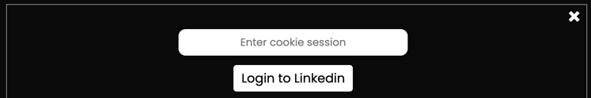

# js-crawler

## Commands
### Install
```npm install```

### Run
```npm start```

## Login to Likedin

We use a session cookie to help the application connect to LinkedIn.

This cookie is li_at.

### How to get the li_at cookie value ?

1. Log in to your Linkedin account
2. Right-click anywhere on the page and click on Inspect.
3. Go to application tab in Chrome ( storage for safari )
4. Then scroll down on the left side. Expand on the Cookies option, you'll see www.linkedin.com
5. Find the li_at value and copy this value.


### Connect scrapper to your Linkedin account :

Simply paste the value of the li_at cookie here:

